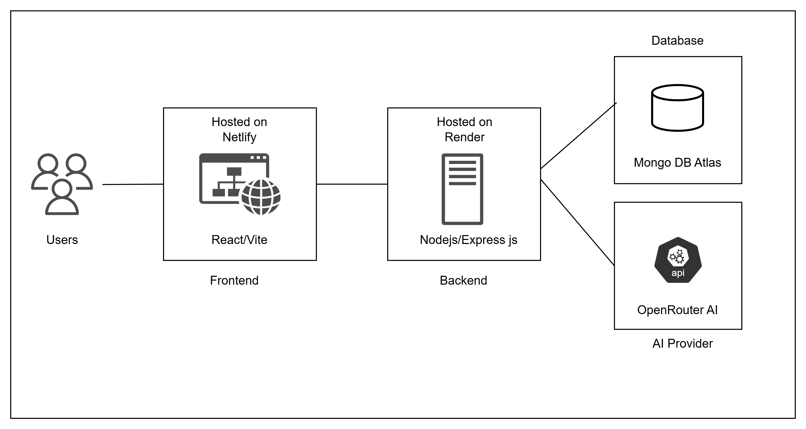

### **RecipeBook 🍽️**

> **An AI-powered meal planner that thinks ahead — delivering the right meal at the right time based on your pantry, eating habits, goals, and nutritional needs.**

Meal planning should feel effortless, not repetitive. **RecipeBook** creates a personalised food experience by understanding your preferences, available ingredients, and daily eating patterns.

---

## Why I Built This

I built RecipeBook from a problem I faced myself — every day I was spending too much time deciding what to cook. I would keep opening AI tools, typing pantry ingredients, dietary preferences, allergies, calorie goals, and asking for meal ideas again and again. The process worked, but repeating it every day became tiring.

So I built RecipeBook — an AI-powered meal planning assistant that remembers preferences, understands what’s available in the pantry, and recommends personalised meals automatically. Instead of searching and prompting every day, users can generate meal plans, discover recipes, and track meals with a single click.

---

## Features

- Secure bearer-token authentication with protected routes throughout
- Dashboard with calorie tracking, pantry overview, and weekly consumption summary
- Personalised meal plans generated from dietary preferences, allergies, health goals, calorie targets, and pantry inventory
- Pantry management with automatic ingredient deduction on meal completion
- AI-generated recipes with ingredients and step-by-step cooking instructions

---

## Tech Stack

| Layer            | Technology                                         |
| ---------------- | -------------------------------------------------- |
| Frontend         | React, Vite, React Router                          |
| State Management | Custom Redux-like store with reducers and dispatch |
| Styling          | Tailwind CSS                                       |
| Charts           | Recharts                                           |
| Backend          | Node.js, Express                                   |
| Database         | MongoDB Atlas with Mongoose                        |
| Authentication   | JWT bearer token flow                              |
| AI Providers     | OpenRouter / OpenAI-compatible APIs                |
| Testing          | Vitest, Supertest                                  |
| Deployment       | Netlify · Render                                   |

---

## Architecture



The diagram shows how RecipeBook is deployed and how data flows through the system:

- Users interact with the React/Vite frontend hosted on Netlify.
- The frontend calls the Node.js/Express backend hosted on Render through API requests.
- The backend handles authentication, profile data, pantry logic, meal-plan generation, and meal completion updates.
- MongoDB Atlas stores users, preferences, pantry items, generated meal plans, and completion history.
- OpenRouter AI is called by the backend to generate recipe suggestions.

---

## Run Locally

```bash
npm run install:all
npm run dev
```

Required environment:

- `server/.env`: `MONGODB_URI`, `JWT_SECRET`, `CLIENT_ORIGIN`, optional `OPENROUTER_API_KEY` or `OPENAI_API_KEY`
- `client/.env`: `VITE_API_BASE_URL`

---

## Core API

Protected routes use `Authorization: Bearer <token>`.

- Auth: register, login, current user
- Profile: dietary preferences, allergies, health goals, meal pattern, serving size
- Pantry: add, update, remove, and list ingredients
- Plans: generate daily meal plans and complete/undo meals
- Dashboard: calorie summary, pantry snapshot, and weekly consumption

---

## Testing

```bash
npm test
```

Vitest and Supertest cover auth utilities, auth middleware, pantry deduction logic, client reducers, and meal math helpers.

---

## Deployment

- Frontend: Netlify
- Backend: Render
- Database: MongoDB Atlas
- AI Provider: OpenRouter / OpenAI-compatible API

Config files included: `netlify.toml`, `render.yaml`.

---

## AI Roadmap

- Add image-based pantry item capture so users can upload a pantry/fridge photo and auto-detect ingredients.
- Add document extraction for personal recipe uploads, then learn recurring ingredients, cuisines, and cooking patterns from the user's own recipes.
- Build a smarter recommendation layer that combines pantry inventory, nutrition goals, recipe history, and user feedback.
- Add shopping-list generation for missing ingredients and substitution suggestions when pantry items are low.

---

## About

Built as a full-stack AI meal-planning app focused on pantry-aware recommendations, persistent user state, and practical AI fallback behavior.

> Stack: React / Vite / Node.js / Express / MongoDB / JWT / Recharts / OpenRouter / Vitest
